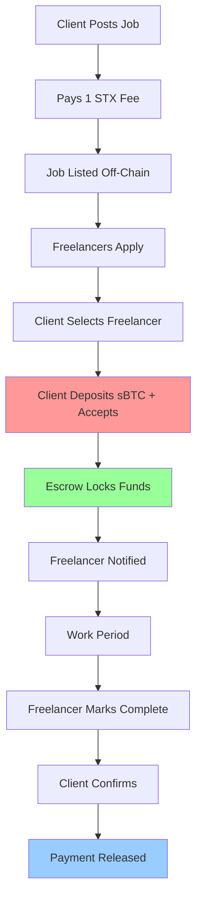

# SkillFlow Smart Contracts

##  Overview

SkillFlow is a decentralized freelancing platform built on the Stacks blockchain that leverages Bitcoin's security through sBTC for payments. The platform eliminates trust issues between clients and freelancers by using smart contract-enforced escrows and a innovative two-step completion process.

###  Key Features

- ** Escrow-First Acceptance**: Freelancers only see job acceptance after funds are locked
- ** Instant Payment Security**: Funds secured the moment freelancer is hired
- ** Two-Step Completion**: Mutual agreement required before payment release
- ** Fair Dispute Resolution**: Platform-mediated conflict resolution
- ** Bitcoin Payments**: Native sBTC integration for global accessibility
- ** Spam Protection**: STX fees prevent fake job postings

## Architecture



## Contract Overview

### Core Contracts

| Contract | Purpose | Key Functions |
|----------|---------|---------------|
| **constants.clar** | Platform configuration | Fee rates, limits, error codes |
| **sip010-trait.clar** | Token standard interface | sBTC compatibility |
| **sbtc-mock.clar** | Payment system (dev) | Token transfers, balances |
| **escrow.clar** | Trust engine | Fund locking, completion flow |
| **skillflow-main.clar** | Platform orchestrator | Job management, user interface |

### Contract Relationships

```
skillflow-main.clar (Orchestrator)
    ├── escrow.clar (Security Layer)
    │   └── sbtc-moc.clar (Payment Layer)
    ├── constants.clar (Configuration)
    └── sip010-trait.clar (Standards)
```

## Installation

### Prerequisites

- [Clarinet](https://github.com/hirosystems/clarinet) v2.0+
- [Node.js](https://nodejs.org/) v18+

### Setup

```bash
# Clone the repository
git clone github repo
cd repo

# Install Clarinet (if not already installed)
curl --proto '=https' --tlsv1.2 -sSf https://sh.rustup.rs | sh
clarinet --version

# Initialize project
clarinet new Stacks-Skills
cd Stacks-Skills

# Copy contracts to contracts/ directory
cp ../contracts/*.clar contracts/

# Run initial checks
clarinet check
```

### Project Structure

```
skillflow-contracts/
├── contracts/
│   ├── constants.clar          # Platform configuration
│   ├── sip010-trait.clar       # Token standard
│   ├── sbtc-moc.clar         # Mock sBTC for testing
│   ├── escrow.clar            # Escrow system
│   └── skillflow-main.clar    # Main platform
├── tests/
│   ├── constants_test.ts
│   ├── escrow_test.ts
├── settings/
│   └── Devnet.toml
├── Clarinet.toml
└── README.md
```

## Usage Guide

### For Clients

#### 1. Post a Job

```clarity
;; Pay job creation fee
(contract-call? .skillflow-main pay-job-creation-fee "website-project-123")
```

**Requirements:**
- Minimum 1 STX balance
- Unique job ID
- Valid principal address

#### 2. Accept Freelancer with Escrow

```clarity
;; Hire freelancer and lock funds in one transaction
(contract-call? .skillflow-main accept-freelancer-with-escrow
  "website-project-123"           ;; job-id
  'ST1SJ3DTE5DN7X54YDH5D64R3BCB6A2AG2ZQ8YPD5  ;; freelancer
  u100000000)                     ;; 0.1 sBTC
```

**What happens:**
- sBTC transferred from client to escrow
- Freelancer notified of acceptance
- Job status updated to "hired"

#### 3. Confirm Job Completion

```clarity
;; Step 2 of completion process
(contract-call? .skillflow-main client-confirm-completion "website-project-123")
```

### For Freelancers

#### 1. Check Job Acceptance Status

```clarity
;; See if you've been hired for a job
(contract-call? .skillflow-main check-freelancer-acceptance 
  "website-project-123"
  tx-sender)
```

#### 2. Mark Job as Completed

```clarity
;; Step 1 of completion process
(contract-call? .skillflow-main freelancer-mark-completed "website-project-123")
```

### For Both Parties

#### Initiate Dispute

```clarity
;; If there's a problem with the job
(contract-call? .skillflow-main initiate-job-dispute "website-project-123")
```

## API Reference

### Main Contract Functions

#### Public Functions

| Function | Parameters | Description | Authorization |
|----------|------------|-------------|---------------|
| `pay-job-creation-fee` | `job-id` | Post new job | Any user with 1+ STX |
| `accept-freelancer-with-escrow` | `job-id`, `freelancer`, `amount` | Hire + fund escrow | Job creator only |
| `freelancer-mark-completed` | `job-id` | Mark work done | Hired freelancer only |
| `client-confirm-completion` | `job-id` | Confirm & release payment | Job creator only |
| `initiate-job-dispute` | `job-id` | Start dispute process | Client or freelancer |

#### Read-Only Functions

| Function | Returns | Description |
|----------|---------|-------------|
| `check-freelancer-acceptance` | Acceptance status | Check if freelancer hired |
| `get-job-complete-status` | Job status details | Complete job information |
| `get-platform-stats` | Platform metrics | Usage statistics |

### Escrow Contract Functions

#### Public Functions

| Function | Parameters | Description | Authorization |
|----------|------------|-------------|---------------|
| `create-escrow` | `job-id`, `client`, `freelancer`, `amount` | Lock funds | Main contract only |
| `mark-job-completed` | `escrow-id` | Freelancer completion | Freelancer only |
| `confirm-job-completion` | `escrow-id` | Release payment | Client only |
| `initiate-dispute` | `escrow-id` | Start dispute | Client or freelancer |
| `resolve-dispute` | `escrow-id`, `refund-percentage` | Admin resolution | Platform admin only |

## Security Features

### 1. Escrow-First Acceptance Model

**Problem Solved:** Fake job acceptances without payment commitment

**Solution:** 
- Freelancers only see acceptance after sBTC is locked in escrow
- Prevents clients from creating false hope without financial commitment
- Guarantees immediate payment security

### 2. Two-Step Completion Process

**Problem Solved:** Payment disputes and rushed transactions

**Solution:**
```
Step 1: Freelancer marks job completed
Step 2: Client confirms satisfaction
Result: Automatic payment release
```

### 3. Time-Based Dispute Window

- **20-day dispute period** after escrow creation
- Prevents indefinite holds on funds
- Encourages timely resolution

### 4. Input Validation

```clarity
;; Example validation functions
(define-private (is-valid-sbtc-amount (amount uint))
  (and (>= amount u100000) (<= amount u100000000000))) ;; 0.001 to 1000 sBTC

(define-private (is-valid-principal (addr principal))
  (and 
    (not (is-eq addr 'SP000000000000000000002Q6VF78))
    (not (is-eq addr (as-contract tx-sender)))))
```

### 5. Access Control

- **Role-based permissions** for all functions
- **Contract owner privileges** for admin functions
- **Participant validation** for escrow operations

## Economic Model

### Fee Structure

| Operation | Fee | Currency | Purpose |
|-----------|-----|----------|---------|
| Job Creation | 1 STX | STX | Spam prevention |
| Transaction Fee | 2.5% | sBTC | Platform sustainability |
| Dispute Resolution | Included | - | Conflict resolution |

### Revenue Distribution

```
Successful Job (100 sBTC payment):
├── Freelancer: 97.5 sBTC (97.5%)
├── Platform: 2.5 sBTC (2.5%)
└── Gas Costs: Covered by users
```

### Minimum Requirements

- **Client Balance:** 1+ STX for job posting
- **Escrow Minimum:** 0.001 sBTC
- **Maximum Escrow:** 1,000 sBTC per job

### Contract Deployment Order

1. `sip010-trait.clar` - Token standard
2. `constants.clar` - Platform configuration  
3. `sbtc-mock.clar` - Payment system
4. `escrow.clar` - Trust engine
5. `skillflow-main.clar` - Platform orchestrator

### Environment Configuration

```toml
# settings/Devnet.toml
[network]
name = "devnet"

[[network.accounts]]
name = "deployer"
address = "ST1PQHQKV0RJXZFY1DGX8MNSNYVE3VGZJSRTPGZGM"
balance = 100000000000000

[[network.accounts]]
name = "client1"
address = "ST1SJ3DTE5DN7X54YDH5D64R3BCB6A2AG2ZQ8YPD5"
balance = 100000000000000

[[network.accounts]]
name = "freelancer1"
address = "ST2CY5V39NHDPWSXMW9QDT3HC3GD6Q6XX4CFRK9AG"
balance = 100000000000000
```

## Testing

### Test Categories

1. **Unit Tests** - Individual contract functions
2. **Security Tests** - Attack vector validation
3. **Economic Tests** - Fee calculation accuracy

### Running Tests

```bash
# All tests
npm test

# Specific test file
npm test tests/escrow-test.ts

# With coverage
npm test --coverage
```

### Example Test Case

```typescript
    // 1. Client posts job
    let block = chain.mineBlock([
      Tx.contractCall("skillflow-main", "pay-job-creation-fee", [
        types.ascii("test-job-123")
      ], client.address)
    ]);
    
    // 2. Client accepts freelancer with escrow
    block = chain.mineBlock([
      Tx.contractCall("skillflow-main", "accept-freelancer-with-escrow", [
        types.ascii("test-job-123"),
        types.principal(freelancer.address),
        types.uint(10000000) // 0.01 sBTC
      ], client.address)
    ]);
    
    // Continue test...;
```

## Deployment

### Mainnet Deployment Checklist

- [ ] All tests passing
- [ ] Security audit completed
- [ ] Documentation updated
- [ ] Frontend integration tested
- [ ] Admin keys secured
- [ ] Emergency procedures documented

### Deployment Commands

```bash
# Deploy to testnet
clarinet deploy --testnet

# Deploy to mainnet (requires preparation)
clarinet deploy --mainnet
```

### Post-Deployment Verification

```bash
# Verify contract deployment
clarinet run scripts/verify-deployment.ts

# Check contract state
clarinet console
```